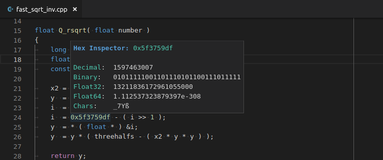

  

# HexInspector

## Overview

**HexInspector** is an extension for [Visual Studio Code] that provides fast and easy way to peek other forms of a hexadecimal/binary/decimal value. You just need to point a value and other forms will be summarized in a hover. Value is recognized as:
- hexadecimal if it starts with `0x` or `#` (e.g. `0x123`, `#1234`),
- binary if it starts with `0b` (e.g. `0b101`),
- decimal if it is contains only digits.

The extension supports both `Little-Endian` and `Big-Endian` byte order. You can choose endianness in settings. The order of displayed forms and input types that trigger the hover can be also set in settings.

Extension is available on the [Marketplace].

## Supported forms

| Form               | When displayed                       | Format                                                 |
|--------------------|--------------------------------------|--------------------------------------------------------|
| Decimal            | Only if a value is not decimal.      | Unsigned (always) / Signed (if the highest bit is set. |
| Hexadecimal        | Only if a value is not hexadecimal.  | With leading zeros.                                    |
| Binary             | Only if a value is not binary.       | With leading zeros.                                    |
| Float16 (IEEE 754) | Only if a alue has at most 2 bytes.  |                                                        |
| Float32 (IEEE 754) | Only if a value has at most 4 bytes. |                                                        |
| Float64 (IEEE 754) | Only if a value has at most 8 bytes. |                                                        |
| Chars              | Always.                              | Sequence of characters                                 |
| Size               | Always.                              | With 3 decimal places if unit is more than byte.       |

## Screenshot

## License

[MIT]

[Visual Studio Code]: https://code.visualstudio.com/
[Marketplace]: https://marketplace.visualstudio.com/items?itemName=mateuszchudyk.hexinspector
[MIT]: LICENSE
